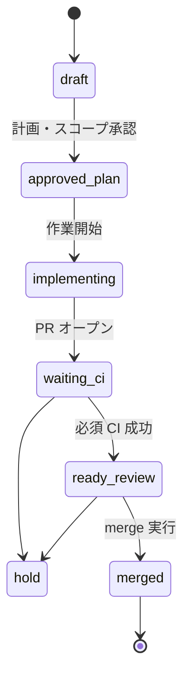

# Checkpoint state machine（運用）

## 目的

- **1 Issue = 1 checkpoint**、**1 PR = 1 目的** の単位で、開発の進み方を揃える。
- **review / hold / rollback** の判断軸を共有し、保留中 checkpoint（例: 外部要因で止まっている PR）の扱いをぶらさない。
- **orchestrator をコード化する前に**、人間が従う**運用状態だけ**を固定する（自動化・実装の話はここでは扱わない）。

## 前提（固定ルール）

- **最小差分**で進める。
- **CI が落ちたら merge しない**（必須チェックが緑になるまで `ready-review` に進めない）。

## 状態一覧

| State | 意味 |
|--------|------|
| **draft** | checkpoint はあるが、計画・スコープが未確定、または作業未着手。 |
| **approved-plan** | 計画・スコープが合意され、**人間が実装に入ってよいと判断した**状態。 |
| **implementing** | 実装・ドキュメントなど、checkpoint 向けの作業が進行中。 |
| **waiting-ci** | PR が開いており、CI（必須チェック）の結果待ち。 |
| **ready-review** | CI が緑など、**merge の可否を判断できる**状態。 |
| **merged** | 変更が既定ブランチ（通常 `main`）に取り込まれた。checkpoint の成果が main に載った。 |
| **hold** | 意図的な保留。merge や進行を止める。 |
| **rollback** | 取り込みを取り消す・戻す方針（revert 等）。checkpoint を「巻き戻し」扱いにする。 |

## 遷移条件（最小）

- **draft → approved-plan**
  計画・スコープが書かれ、**担当者またはオーナーが承認**したとき。
- **approved-plan → implementing**
  ブランチで作業を開始したとき。
- **implementing → waiting-ci**
  目的に対応する **PR を開いた**とき（1 PR = 1 目的）。
- **waiting-ci → ready-review**
  **必須 CI がすべて成功**したとき。
- **waiting-ci → hold**
  CI が赤のまま方針を止める、外部ブロッカーで止める、など**保留にした**とき。
- **ready-review → merged**
  **レビュー・merge の判断**のうえ、既定ブランチへ merge したとき。
- **ready-review → hold**
  merge 前に保留にしたとき（レビュー差し戻し、依存待ちなど）。
- **任意の状態 → hold**
  運用上、進行を止める必要が出たとき。
- **任意の状態 → rollback**
  **巻き戻しが決まった**とき（revert PR の方針確定など）。以降は新しい Issue / checkpoint でやり直すか、別途運用で決める。

## hold になる条件（例）

- 外部依存（API 制限、インフラ、他 PR の merge 待ち）で**今すぐ進めない**と判断したとき。
- **CI が緑にならない**間は `ready-review` にせず、方針を止めるなら **hold**。
- スコープや優先度の見直しが必要で、**一時的に手を離す**とき。

## rollback になる条件（例）

- merge 後に問題が判明し、**revert 等で main を戻す**方針が決まったとき。
- checkpoint の成果を**無効化する**運用判断が出たとき。

## merged の定義

- 当該 checkpoint の **PR が既定ブランチ（通常 `main`）に merge された**状態を **merged** とする。
- **CI が赤のまま merge しない**（固定ルール）。squash / merge commit の方式はリポジトリ運用に従う。

## 人間承認が必要なところ

1. **draft → approved-plan**
   計画・スコープの合意（「この checkpoint で何をするか」の承認）。
2. **ready-review → merged**
   レビューと merge の可否の判断（**CI 緑**を前提）。

hold / rollback は**判断そのもの**であり、必ずしも別ラベルで記録しなくてもよいが、Issue / PR のコメントで **hold 理由** または **rollback 方針** を残すと判断軸が揃う。

## 状態遷移図（参考）

図は主要パスのみ。hold / rollback の全パターンは「遷移条件」を正とする。

（Issue / PR の説明と CI の結果をソース・オブ・トゥルースとする。）
